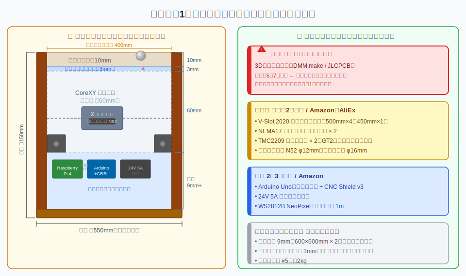
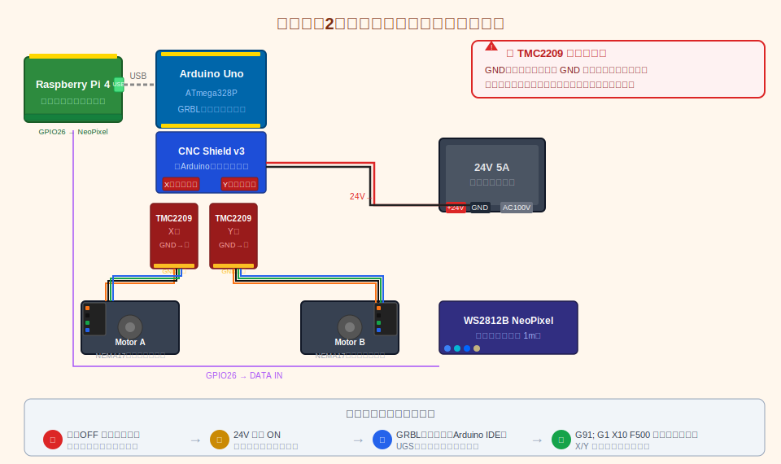
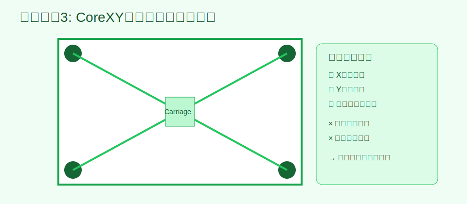
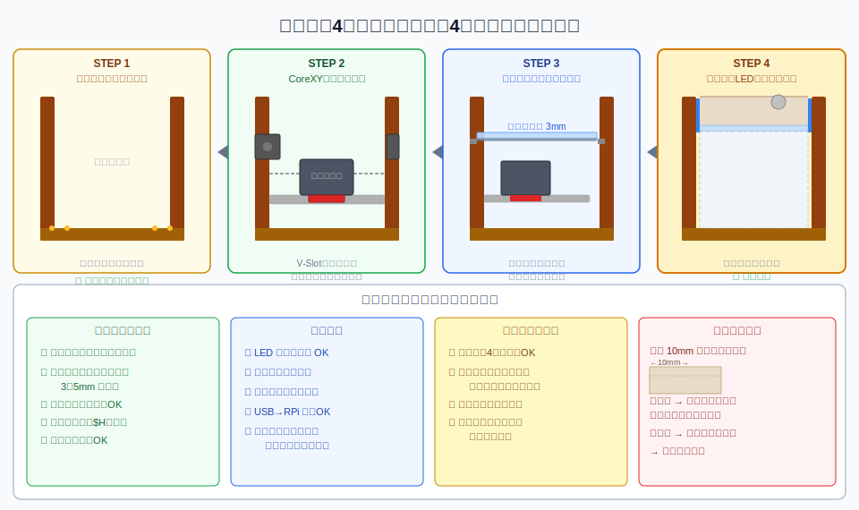
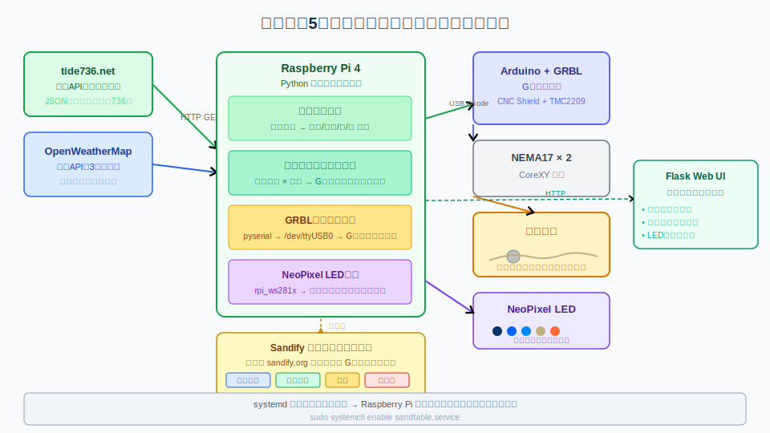
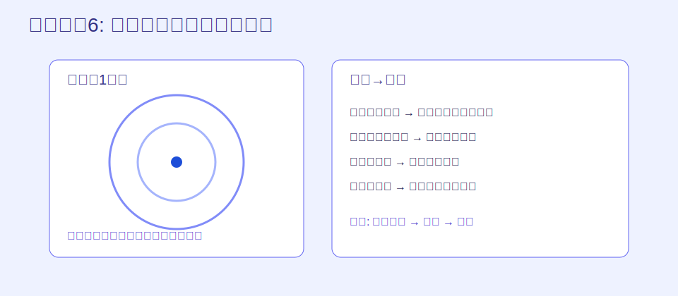
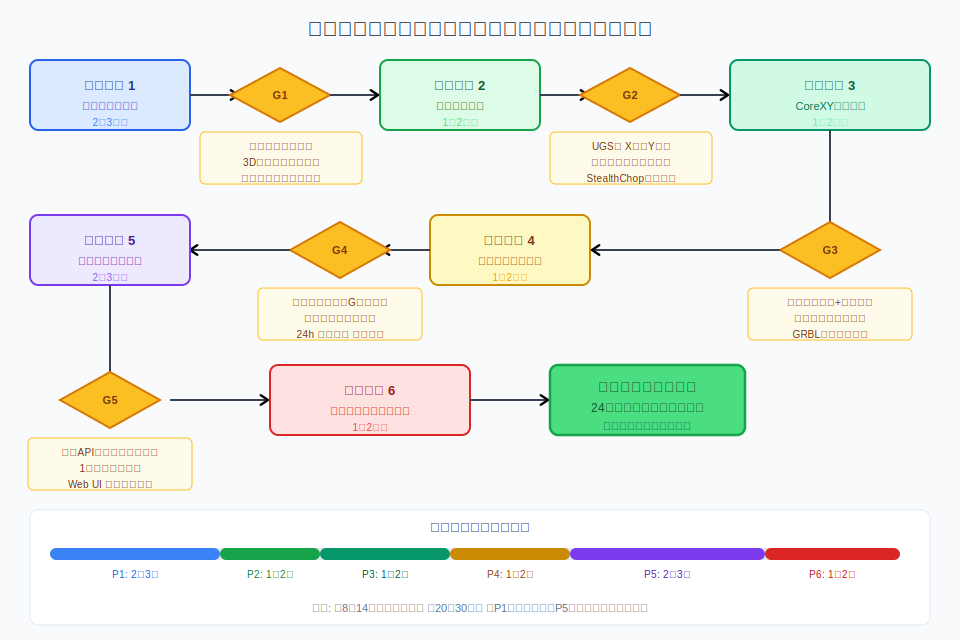
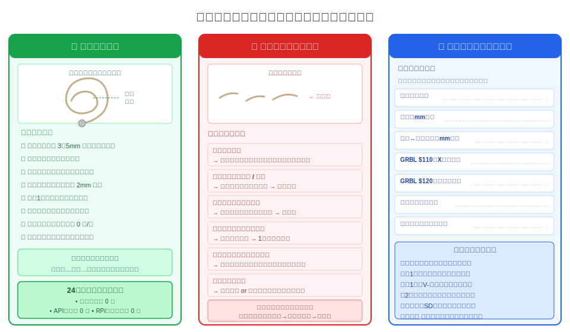

# 潮汐キネティック・サンドテーブル ロードマップ

## 概要

Raspberry Pi 4を中核として、CoreXY機構で砂上のスチールボールを動かすキネティック・サンドテーブルを自作する。日本沿岸の潮汐データ（tide736.net API）と天気データ（OpenWeatherMap API）をリアルタイムに取得し、潮位・天気状態に応じて砂紋パターンの種類・速度・スケールを自動で変化させる。木工経験を活かし、テーブル筐体は木製で製作する。

## 先に完成イメージを掴む（作業前に読む）

画像やイラストがないと工程の意味がつかみにくいため、まずは「上から見た姿」と「横から見た内部構造」を確認してから着手する。

### 上面イメージ（ユーザーが普段見る面）


- 白砂のキャンバス（約400×400mm）の上を、スチールボールがゆっくり移動して模様を描く
- 木枠の内周にLEDを仕込むことで、夜間でも砂紋が視認しやすい
- 日常利用時は「ローテーブル」、動作時は「インテリア作品」の2役になる

### 断面イメージ（作業者が理解すべき構造）


- 4層構造（砂層 → アクリル → CoreXY空間 → 電装層）
- ボールを直接押すのではなく、**アクリル下の磁石で間接的に牽引**する
- 砂面の美しさは「磁石高さ」「砂厚」「水平」の3要素で決まる

### 各フェーズで“どこを作っているか”早見表

| フェーズ | 触る主対象 | 見た目の変化 |
|---|---|---|
| フェーズ1 設計・調達 | 図面、部品表、発注 | 机の上に部品が揃い始める |
| フェーズ2 電装 | Arduino/CNC Shield/配線 | モーター単体が回る |
| フェーズ3 メカ組立 | V-Slot、ベルト、キャリッジ | 砂なしでボール追従が起きる |
| フェーズ4 木工筐体 | 木枠、アクリル、砂 | テーブル外観が完成する |
| フェーズ5 ソフト | Python、API、Web UI | 潮汐連動で模様が自動切替 |
| フェーズ6 調整 | 全体統合・連続運転 | 安定稼働して鑑賞可能になる |

## 技術方針

| 項目 | 決定事項 | 根拠 |
|---|---|---|
| 駆動方式 | CoreXY（直交座標系） | 極座標系（Sisyphusオリジナル）はスリップリングが必要で難易度が高い。CoreXYは3Dプリンター部品が流用でき、情報量が豊富 |
| テーブル形状 | 正方形（描画エリア約400×400mm） | CoreXYとの相性が良く、テーブル製作が円形より容易。コーヒーテーブルとしても使用可能なサイズ |
| モーター制御 | Arduino Uno + CNC Shield v3 + GRBL | 3Dプリンター/CNCの業界標準。ドキュメントとコミュニティが非常に充実。Raspberry Piとシリアル(USB)で接続 |
| ステッピングモーター | NEMA17（1.8°/step） | CoreXYの標準。入手性とコストのバランスが最良 |
| モータードライバー | TMC2209（UART制御、StealthChop） | 静音性がサンドテーブルに不可欠。センサーレスホーミングにも対応 |
| コントローラー | Raspberry Pi 4（入手済み） | API取得、パターン選択ロジック、GRBLへのGコード送信、Webサーバー（操作UI）を一台で担う |
| パターン生成 | Sandify（https://sandify.org/）で事前生成 + Pythonによる動的パラメトリック生成 | Sandifyで基本パターンのGコードライブラリを構築。潮汐データに応じてPythonが適切なパターンを選択・パラメータ調整 |
| 潮汐データ | tide736.net API（JSON、日本沿岸736港） | 無料、JSON形式でRaspberry Piから容易に取得。毎時潮位・満潮干潮時刻が取得可能 |
| 天気データ | OpenWeatherMap API（Free tier） | 補助データとして気温・天気状態を取得し、LED照明色に反映 |
| 砂床 | キャスト・アクリル板（3mm厚）の上に白砂（珪砂0.2〜0.5mm）を10mm厚 | 磁力が3mmアクリルを透過可能。キャストアクリルは押出しより光学的にクリアで傷に強い |
| 磁石 | ネオジム磁石（N52、φ12〜15mm円柱） | ボールとの磁力結合に十分な強度。3mmアクリル越しで確実にボールを牽引 |
| ボール | クロム鋼球（φ16mm） | 砂との摩擦が適度で、軌跡が明瞭 |
| 3Dプリント部品 | DMM.make 等の3Dプリントサービスを利用 | 3Dプリンター未所有のため外注。CoreXYのブラケット・キャリッジ等の構造パーツをPLAまたはPETGで発注 |
| 照明 | WS2812B NeoPixelストリップ（テーブル内周） | 潮汐状態・天気に連動して照明色を変化 |
| テーブル筐体 | 合板＋パイン角材で自作 | 木工経験を活用。ホームセンターの木材で製作可能 |

## 前提条件

- Raspberry Pi 4 × 1台を本プロジェクトに充当
- はんだ付けは初心者（ニキシー管クロック・フェーズ2で習得予定 or 本プロジェクトのフェーズ2で並行習得）
- 木工の基礎経験あり（のこぎり、電動ドリル、木ネジ等の使用可能）
- 3Dプリンターは未所有（外注サービスを利用）
- レーザーカッターは利用不可
- 予算: 約4〜6万円（Raspberry Pi本体代を除く）

---

## フェーズ1: 設計と部品調達

### 目的

テーブル全体の寸法設計を確定し、すべての部品を発注する。3Dプリント部品は納期が最長のため最優先で発注する。

### 期間

2〜3週間（3Dプリントサービスの納期を含む）

### 手順

#### ステップ1-1: 全体寸法の決定と設計図面の作成（2日）

**作業イメージ（イラスト）**


テーブルの各層を以下のように設計する。

```
【断面図（横から見た構造）】

  ┌─────────────────────────┐
  │   砂（白砂 10mm厚）        │  ← スチールボールがここで動く
  ├─────────────────────────┤
  │  アクリル板（透明・3mm厚）  │  ← 砂床の底面。磁力が通過する
  ├─────────────────────────┤
  │  空間（約60mm）           │  ← CoreXYキャリッジ＋磁石がここを移動
  │  [Xキャリッジ→磁石N52]   │      ↑ここに磁石があるためボールが引かれる
  ├─────────────────────────┤
  │  底板（合板 9mm厚）        │  ← 電子部品の搭載面
  │  [RPi 4][Arduino][PSU]   │
  └─────────────────────────┘

  外寸: 約550×550×150mm（脚を除く）
  描画エリア: 400×400mm（CoreXYの可動範囲）
```

> **ポイント：** 磁石はアクリル板の裏側（下側）を動き回る。ボールは砂の中（上側）にいる。直接触れていないのに磁力で引かれるのがこのテーブルの仕組み。

設計ツールは無料の Fusion 360（個人利用）または SketchUp を使用。紙と鉛筆でも可。最低限、以下の寸法を確定させる:

| 確定する寸法 | 設計値 | 計算根拠 |
|---|---|---|
| 描画エリア（内寸） | 400×400mm | CoreXYの可動範囲 |
| CoreXYレール長（X方向） | 500mm | 描画エリア＋両端キャリッジ幅 |
| CoreXYレール長（Y方向） | 500mm | 同上 |
| Xガントリーレール長 | 450mm | 描画エリア幅＋余裕 |
| 木枠外寸 | 550×550mm | レール＋木壁厚 |
| テーブル総高さ | 約150mm | 砂10+アクリル3+空間60+合板9+底板 |
| アクリル板サイズ | 450×450mm | 木枠内寸 |

#### ステップ1-2: 3Dプリント部品の発注（初日に着手）

rdudhagra/Sand-Table（https://github.com/rdudhagra/Sand-Table）のSTLファイルを参考に、CoreXYのキャリッジ、コーナーブラケット、ベルトテンショナー、磁石ホルダー等を3Dプリントサービス（DMM.make、JLCPCB、PCBWay等）に発注する。

主な3Dプリント部品リスト:
- CoreXYコーナーブラケット × 4
- Xキャリッジ（磁石ホルダー兼用） × 1
- ベルトアイドラーマウント × 4〜6
- モーターマウント × 2
- エンドストップマウント × 2（センサーレスホーミング使用時は不要）

材質: PETG推奨（PLAより耐久性が高い）。概算コスト: 約3,000〜5,000円。

#### ステップ1-3: メカニカル部品の発注（初日に着手）

| 部品 | 仕様 | 数量 | 概算コスト | 購入先例 |
|---|---|---|---|---|
| V-Slotアルミフレーム 2020 | 長さ500mm | 4本 | 約3,000円 | OpenBuilds Partstore / Amazon / AliExpress |
| V-Slotアルミフレーム 2020 | 長さ450mm（Xガントリー用） | 1本 | 約800円 | 同上 |
| GT2タイミングベルト | 幅6mm | 3m | 約500円 | Amazon |
| GT2プーリー 20T | φ5mm軸 | 2個 | 約400円 | Amazon |
| GT2アイドラープーリー 20T | 歯なし、φ3mm軸 | 6個 | 約600円 | Amazon |
| NEMA17ステッピングモーター | 1.8°、1.5A以上 | 2台 | 約2,000円 | Amazon |
| Vホイール（Delrin） | V-Slot用 | 8〜12個 | 約1,500円 | OpenBuilds / Amazon |
| 偏心スペーサー | Vホイール用 | 4〜6個 | 約500円 | 同上 |
| ネオジム磁石 N52 | φ12mm × 高さ10mm 円柱 | 2〜3個（スタック用） | 約500円 | Amazon |
| クロム鋼球 | φ16mm | 3個（予備含む） | 約300円 | Amazon |

#### ステップ1-4: 電子部品の発注（初日に着手）

| 部品 | 仕様 | 数量 | 概算コスト |
|---|---|---|---|
| Arduino Uno（互換品可） | ATmega328P | 1 | 約600円 |
| CNC Shield v3 | GRBL対応 | 1 | 約300円 |
| TMC2209ステッパードライバー | UART対応 | 2 | 約1,000円 |
| 24V電源アダプター | 24V 5A以上 | 1 | 約2,000円 |
| WS2812B NeoPixelストリップ | 30LED/m、1m | 1 | 約800円 |
| USBケーブル（A-B） | Arduino接続用 | 1 | 約300円 |
| ジャンパーワイヤー各種 | | 1セット | 約300円 |

#### ステップ1-5: 木材とアクリル板の調達（1日）

ホームセンターで以下を購入:

| 材料 | 仕様 | 概算コスト |
|---|---|---|
| シナ合板 | 9mm厚、600×600mm × 2枚（底板＋中間板） | 約1,500円 |
| パイン角材 | 30×40mm × 2m × 2本（テーブル枠） | 約800円 |
| キャスト・アクリル板 | 透明3mm厚、450×450mm | 約2,000円（はざいや等でカット注文） |
| 白砂（珪砂） | #5号（0.3〜0.6mm）2kg | 約500円 |
| 木ネジ、木工用ボンド、紙やすり等 | | 約500円 |

### 成果物

- 確定した設計図面（寸法図）
- 全部品の発注完了
- 3Dプリント部品の発注書

### リスクと対策

| リスク | 影響 | 対策 |
|---|---|---|
| 3Dプリント部品の納期遅延 | 全体スケジュール遅延 | 最優先で発注。国内サービス（DMM.make）なら5〜7営業日が目安 |
| V-Slotフレームの入手困難 | 代替品の検索が必要 | AliExpressは安価だが納期2〜3週間。急ぐ場合はAmazon or OpenBuilds Japan |
| アクリル板の厚さと磁力の関係 | ボールが磁石に追従しない | 3mm厚で通常は問題なし。不安なら2mm厚も検討（ただし撓みに注意） |

---

## フェーズ2: はんだ付け習得と電子回路組立

### 目的

CNC Shield + TMC2209ドライバーの配線と、NeoPixel LEDの配線を完了する。はんだ付けが必要な箇所は最小限だが、確実に行えるスキルを身につける。

### 期間

1〜2週間

### 手順

#### ステップ2-1: はんだ付け練習（ニキシー管クロックのフェーズ2と共通化可能）（2〜3日）

前回のロードマップのフェーズ2と同一。HAKKO FX600＋練習キットで基礎を習得する。本プロジェクトではんだ付けが必要な箇所は以下に限定される:
- NeoPixelストリップへのリード線接続（3本: 5V、GND、DATA IN）
- 必要に応じてTMC2209のUARTピンへのジャンパー

#### ステップ2-2: GRBLファームウェアの書き込み（1時間）

Arduino UnoにGRBL v1.1をArduino IDEで書き込む。

```bash
# Arduino IDEでGRBLライブラリをインストール後、
# スケッチ例 → grblUpload を選択して書き込み
```

#### ステップ2-3: CNC Shield + TMC2209の組立と配線（2時間）

**作業イメージ（イラスト）**


CNC Shield v3をArduino Unoに装着し、TMC2209ドライバーを X軸・Y軸スロットに挿入する。

> ⚠️ **TMC2209の向きに注意：** GNDピン（チップ側のマーキングを確認）をシールドの GND シルク側に合わせる。**逆挿しすると即破損**（煙が出る前に気づけない場合が多い）。挿入前に必ず写真や動画で向きを確認する。

**配線の順序（必ず守る）：**

1. **電源OFFの状態で** CNC ShieldをArduinoに重ねて装着
2. TMC2209をX軸・Y軸スロットに向きを確認して挿入
3. モーターケーブルをX/Y軸に接続（4芯コネクタ、極性あり）
4. 24V電源ケーブルをCNC Shieldの入力端子に接続（赤=+、黒=GND）
5. **テスターで電源端子の短絡がないことを確認**してから通電
6. NeoPixelのリード線（3本: 5V・GND・DATA IN）をRaspberry PiのGPIO26に接続

```
配線チェックリスト：
  □ TMC2209 X軸の向き（GNDピン側）を確認
  □ TMC2209 Y軸の向き（GNDピン側）を確認
  □ モーターA → X軸スロット
  □ モーターB → Y軸スロット
  □ 24V +端子（赤線）
  □ GND 端子（黒線）
  □ テスターで短絡チェック（通電前に必須）
```

#### ステップ2-4: モーター単体動作テスト（1時間）

モーターをCNC Shieldに接続し、Universal Gcode Sender（UGS）からテストコマンドを送信してモーターが正しく回転することを確認。

```gcode
G91          ; 相対座標モード
G1 X10 F500  ; X軸方向に10mm移動
G1 Y10 F500  ; Y軸方向に10mm移動
```

#### ステップ2-5: TMC2209のStealthChop設定（30分）

静音動作のため、TMC2209のMS1/MS2ピンでマイクロステップを1/16に設定。StealthChopモードが有効になっていることを確認（TMC2209はデフォルトでStealthChop有効）。

### 成果物

- GRBLが動作するArduino Uno + CNC Shield
- モーター2台の単体動作確認済み
- NeoPixelストリップのはんだ付け済み

### リスクと対策

| リスク | 影響 | 対策 |
|---|---|---|
| TMC2209の逆挿し | ドライバーの即死 | 挿入前にピン配置を写真付きで確認。GNDのシルクと合わせる |
| GRBLのCoreXY設定ミス | 軸方向が逆転 or 斜めに動く | GRBL設定で `$0`〜`$132` のステップ/mm、方向反転ビットを正しく設定 |
| 24V電源のショート | 部品破損・火災 | 通電前に必ずテスターで短絡チェック。ヒューズ付き電源を推奨 |

---

## フェーズ3: CoreXYメカニズムの組立

### 目的

V-Slotフレーム、ベルト、プーリー、キャリッジを組み立て、CoreXYの動作領域全域で正確な動きを実現する。

### 期間

1〜2週間

### 手順

#### ステップ3-1: V-Slotフレームの組立（半日）

4本の500mmフレームで正方形の外枠を組み、内部に450mmのXガントリーレールを配置する。フレームの接合にはL字ブラケットまたは3Dプリントしたコーナーブラケットを使用。**直角の精度が全体の描画品質を決める**ため、スコヤ（直角定規）で各コーナーを確認する。

#### ステップ3-2: CoreXYベルトの配線（2〜3時間）

**作業イメージ（イラスト）**


CoreXYのベルト経路は独特で間違えやすい。rdudhagra/Sand-Tableのビルドガイドに掲載されているベルト配線図を**プリントアウトして壁に貼り**、見ながら作業する。

> ⚠️ **CoreXYの仕組み（先に理解する）：**
> - ベルトA（Motor A担当）とベルトB（Motor B担当）の2本が別の経路でキャリッジに結合されている
> - 両モーター同方向回転 → X方向移動
> - 両モーター逆方向回転 → Y方向移動
> - **経路が1か所でも間違うと対角線方向にしか動かない**

**ベルト配線手順：**

1. 2本のGT2ベルトをそれぞれ約1.2〜1.5mにカット（余裕を持たせる）
2. ビルドガイドの図を見て、アイドラープーリーをフレーム各所に配置
3. **ベルトA**を経路に沿って配線し、キャリッジの固定穴A側に固定
4. **ベルトB**を経路に沿って配線し、キャリッジの固定穴B側に固定
5. ベルトテンショナーで両ベルトの張力を均等に調整

**合格基準（モーター接続前に手で確認）：**
- キャリッジを左右に動かすと、両モーターのプーリーが同方向に回転する → X軸OK
- キャリッジを前後に動かすと、両モーターのプーリーが逆方向に回転する → Y軸OK
- **対角線方向しか動かない** → ベルト経路の誤配線（最初からやり直す）

#### ステップ3-3: 磁石ホルダーの取り付け（30分）

Xキャリッジに3Dプリントした磁石ホルダーを取り付け、ネオジム磁石（2〜3個スタック）を挿入。磁石の高さが砂床（アクリル板裏面）との間で3〜5mmの隙間になるよう調整。

#### ステップ3-4: モーター取り付けとGRBLキャリブレーション（2時間）

NEMA17をフレームのコーナーに固定し、CNC Shieldと接続。GRBLの設定パラメータを調整:

```
$0=10     ; ステップパルス時間（μs）
$1=25     ; ステップアイドル遅延（ms）
$100=80   ; X軸 steps/mm（20T プーリー、1/16マイクロステップ）
$101=80   ; Y軸 steps/mm
$110=3000 ; X軸最大速度（mm/min）
$111=3000 ; Y軸最大速度
$120=200  ; X軸加速度（mm/s²）
$121=200  ; Y軸加速度
$130=400  ; X軸最大移動距離（mm）
$131=400  ; Y軸最大移動距離
```

**重要**: CoreXYではモーターAとBが同時に動いてX/Y移動を実現するため、GRBLの設定で `$37`（CoreXYイネーブル）が有効であることを確認。GRBL 1.1のCoreXY対応版を使用する。

#### ステップ3-5: 描画テスト（磁石のみ、砂なし）（1時間）

アクリル板の上にスチールボールを置き、磁石でボールが追従することを確認。UGSから簡単な四角形や円のGコードを送信し、ボールが正確に動くことをテスト。

### 成果物

- 組み立て完了したCoreXYメカニズム
- キャリブレーション済みのGRBL設定
- スチールボールの追従確認

### リスクと対策

| リスク | 影響 | 対策 |
|---|---|---|
| CoreXYベルト配線の間違い | X/Y軸が逆 or 動きが歪む | ベルト配線図をプリントアウトして壁に貼り、何度も見比べながら作業 |
| フレームの直角ずれ | 四隅で描画がずれる | 組立時にスコヤで確認。対角線の長さが等しいことを測定 |
| 磁力不足（ボールが追従しない） | パターンが崩れる | 磁石のスタック数を増やす or アクリル板を2mm厚に変更 |
| ベルトの張力不足/過多 | バックラッシュ or ステップ脱落 | 指でベルトを弾いて低い音がする程度に調整。きつすぎるとモーターに過負荷 |

---

## フェーズ4: テーブル筐体の製作

### 目的

CoreXYメカニズムを収納し、砂床を支え、美しく安全なテーブル筐体を木工で製作する。

### 期間

1〜2週間

### 手順

#### ステップ4-1: 木枠の切り出しと組立（1〜2日）

パイン角材を4本カットし、外枠（約550×550mm内寸）を組む。木工用ボンド＋木ネジで接合。底板（合板9mm）をネジ止め。

#### ステップ4-2: 中間棚板の設置（半日）

アクリル板を載せる中間棚板を、外枠内側にL字金具で支持。CoreXYメカニズムとの間に約60mmの空間を確保する。

#### ステップ4-3: アクリル板の設置と防振処理（半日）

**作業イメージ（イラスト：STEP1〜4の組立順序）**


中間棚板の上にアクリル板を設置。アクリル板とフレームの間にフェルトテープを挟み、振動と騒音を低減する。

> **アクリル設置前のチェック：** キャリッジを全域（四隅・中央）に移動させ、アクリル板を素手で下から当てながらキャリッジとの隙間が 3〜5mm になる高さを確認する。隙間が合わない場合は中間棚板の高さを調整する。

最後にアクリル板と木枠の隙間を**シリコンコーキング**で塞ぐ。これをしないと砂がCoreXY空間に落ちてメカニズムが詰まる。

#### ステップ4-4: NeoPixel LEDの取り付け（1時間）

テーブル内側の上部（砂面と同じ高さ）の四辺にNeoPixelストリップを貼り付け、砂面を横から照らす。配線はテーブル背面に開けた小穴（φ10mm程度）から外に出し、Raspberry PiのGPIO26に接続する。

```
NeoPixel配線（3本のみ）:
  5V    → Raspberry Pi 5V ピン（または外部5V）
  GND   → Raspberry Pi GND ピン
  DATA  → Raspberry Pi GPIO26
```

#### ステップ4-5: 砂の投入と水平調整（30分）

白砂（珪砂 #5号）をアクリル板上に均一に10mm厚で敷く。

**砂の投入手順：**
1. 少量（500g程度）を中央に盛り、手で均一に広げる
2. 全面に広げたら定規などで厚みを確認（目標10mm）
3. 水準器をアクリル板の上に置き、テーブルの脚・フェルトパッドで水平を調整
4. 砂が一方に偏っていないか、四隅の厚みを確認する

> **水平の重要性：** テーブルが 2mm 以上傾いていると、砂が低い方向に集まって描画品質が低下する。アジャスター付きの脚を使うか、底面のフェルトパッドを厚さ調整して水平を出す。

#### ステップ4-6: 塗装と仕上げ（1〜2日）

紙やすり（#180→#240）で全面を研磨後、水性ウレタンニス or ワックスオイルで塗装。2〜3回の重ね塗り（乾燥時間含む）。

### 成果物

- 砂が敷かれた完成状態のテーブル筐体
- NeoPixel LED取り付け済み

### リスクと対策

| リスク | 影響 | 対策 |
|---|---|---|
| 砂がアクリル板の隙間から下に落ちる | メカニズムに砂が入り故障 | アクリル板と枠の隙間をシリコンコーキングでシール |
| テーブルの水平ずれ | ボールが片方に流れる | アジャスター付きの脚を使用 or テーブル底面にフェルトパッドを貼って微調整 |
| モーター音がテーブル天板に共振 | うるさい | モーターマウントにシリコングロメットを挟む。底板とフレームの間にも防振ゴム |

---

## フェーズ5: ソフトウェア開発（潮汐連動）

### 目的

Raspberry Pi上で動作するPythonアプリケーションを開発し、潮汐API・天気APIのデータに基づいてパターンの自動選択・Gコード送信・LED制御を行う。

### 期間

2〜3週間

### 手順

**ソフトウェア構成イメージ（イラスト）**


#### ステップ5-1: Raspberry PiのGRBLシリアル通信（1日）

Raspberry PiからArduino（GRBL）にUSBシリアルでGコードを送信するPythonモジュールを作成。まず、動作確認のために以下の環境をセットアップする。

```bash
# Raspberry Piで実行（初回セットアップ）
sudo apt update && sudo apt install -y python3-pip
pip3 install pyserial requests flask rpi_ws281x

# シリアルポート確認
ls /dev/ttyUSB*  # Arduino が ttyUSB0 として認識されているか確認
```

```python
import serial
import time

class GRBLSender:
    def __init__(self, port='/dev/ttyUSB0', baud=115200):
        self.ser = serial.Serial(port, baud, timeout=1)
        time.sleep(2)  # GRBLの起動待ち
        self.ser.flushInput()

    def send_gcode(self, filepath):
        with open(filepath, 'r') as f:
            for line in f:
                cmd = line.strip()
                if cmd and not cmd.startswith(';'):
                    self.ser.write((cmd + '\n').encode())
                    response = self.ser.readline().decode().strip()
                    # 'ok' が返るまで待機
```

#### ステップ5-2: パターンライブラリの構築（1〜2日）

Sandify（https://sandify.org/）を使い、以下のカテゴリでGコードファイルを事前生成する:

| カテゴリ | パターン例 | 潮汐状態との対応 |
|---|---|---|
| 大渦巻き | 大きなスパイラル、放射状 | 満潮（潮位が最大値付近） |
| 細密波紋 | 同心円の細かいリップル | 干潮（潮位が最小値付近） |
| 流線 | 一方向に流れるような曲線 | 上げ潮（潮位上昇中） |
| 引き潮模様 | 扇状に広がる放射線 | 下げ潮（潮位下降中） |
| 嵐模様 | ランダム性の高いジグザグ | 天気が「雷雨」または「暴風」 |
| 枯山水（静寂） | 平行な直線群 | 深夜（22:00〜06:00） |
| クリアパターン | 全面を均す渦巻き | パターン遷移時の消去用 |

各パターンを5〜10バリエーション生成し、ファイルとして保存（合計30〜50ファイル）。

#### ステップ5-3: 潮汐データ取得モジュールの開発（半日）

tide736.net APIから最寄りの港の潮汐データをJSON形式で取得する。

```python
import requests
from datetime import date

def get_tide_data(port_code="TK"):  # TK=東京
    today = date.today().strftime("%Y%m%d")
    url = f"https://tide736.net/api/get_tide.php?pc={port_code}&dt={today}"
    res = requests.get(url)
    data = res.json()
    return {
        "hourly_levels": data.get("tide", []),
        "high_tides": data.get("high", []),
        "low_tides": data.get("low", []),
    }
```

#### ステップ5-4: 潮汐→パターン変換ロジックの実装（1〜2日）

現在の潮位をリアルタイムに取得し、以下のロジックでパターンを選択する:

```
1. 毎時APIをポーリング → 現在潮位を取得
2. 前回潮位との差分から「上げ潮/下げ潮/停滞」を判定
3. 潮位の絶対値から「満潮域(>80%)/中間域/干潮域(<20%)」を判定
4. 天気APIから現在の天気状態を取得
5. 上記を組み合わせてパターンカテゴリ＋バリエーションを選択
6. クリアパターン→選択パターンの順にGコードを送信
7. パターン描画速度（F値）を潮位変化速度に応じて調整:
   - 潮位変化が急 → F値を大きく（速い描画）
   - 潮位変化が緩 → F値を小さく（ゆっくり描画）
```

#### ステップ5-5: NeoPixel LED制御（半日）

`rpi_ws281x` ライブラリでLEDを制御。潮汐状態と天気で色を変化させる:

| 状態 | LED色 |
|---|---|
| 満潮 | 深い青 (#003366) |
| 干潮 | 砂色 (#C2B280) |
| 上げ潮 | 青→深い青へのグラデーション遷移 |
| 下げ潮 | 深い青→砂色へのグラデーション遷移 |
| 日の出/日の入り | 暖色オレンジ (#FF6B35) |
| 深夜 | 消灯 or 月光色の微弱白 |

#### ステップ5-6: Webコントロールパネルの構築（1〜2日）

Flask（Python）で簡易的なWeb UIを構築し、スマートフォンからテーブルを制御できるようにする。

機能:
- 現在の潮汐データと選択中パターンの表示
- 手動パターン選択
- 描画速度の手動調整
- 一時停止/再開
- LED明るさ・色の手動調整

#### ステップ5-7: systemdサービス化と自動起動（1時間）

Pythonアプリケーションをsystemdサービスとして登録し、Raspberry Pi起動時に自動で潮汐連動サンドテーブルが開始するようにする。

### 成果物

- 潮汐連動パターン選択Pythonアプリケーション
- Sandify生成パターンライブラリ（30〜50ファイル）
- Flask Web UI
- systemdサービス定義

### リスクと対策

| リスク | 影響 | 対策 |
|---|---|---|
| tide736.net APIのサービス停止 | 潮汐データ取得不可 | フォールバックとして気象庁のCSVデータを定期ダウンロードし、ローカルに潮汐予測テーブルを持つ |
| パターン遷移時にボールが引っかかる | 砂が荒れる、ボールが停止 | クリアパターン（全面均し）を遷移時に必ず挿入。加速度を控えめに設定 |
| Gコード送信中のシリアル通信エラー | パターンが途中で止まる | GRBLのストリーミングプロトコルで`ok`応答を確認。タイムアウト時はリセット＆再送 |

---

## フェーズ6: 統合テストと最終調整

### 目的

全コンポーネントを統合し、24時間以上の連続運転テストでシステムの安定性を確認する。

### 期間

1〜2週間

### 手順

#### ステップ6-1: 全体統合と初回動作確認（半日）

**作業イメージ（イラスト）**


テーブル筐体にCoreXYメカニズム、電子部品、Raspberry Piをすべて組み込み、初めて砂の上でパターンを描画する。

**最初に描くべきパターン：シンプルな同心円**

複雑なパターンより、同心円（スパイラル）から始めること。理由：
- 全域を使うので磁石高さの問題がすぐわかる
- 線幅の均一性でベルト張力の問題がわかる
- コーナーがないので配線ミスと区別しやすい

```gcode
; 最初の動作確認Gコード（UGSから手動で送信）
$H           ; ホーミング（原点出し）
G21          ; mm単位
G90          ; 絶対座標
G0 X200 Y200 ; 中央に移動
G2 X200 Y200 I80 J0 F800  ; 半径80mmの円を1周
G2 X200 Y200 I50 J0 F800  ; 半径50mmの円を1周
G2 X200 Y200 I25 J0 F800  ; 半径25mmの円を1周
```

**見るべき観察ポイント：**
- ボールは砂の上をスムーズに追従しているか
- 線幅は 3〜5mm 程度で均一か
- 円は真円か（歪んでいたらベルト経路の問題）
- 音は静かか（「シュ…シュ…」が正常。「カチン」は磁石が近すぎる）

#### ステップ6-2: 磁石高さと砂深さの微調整（1〜2時間）

ボールの追従性と砂紋の明瞭さを最適化する。磁石が近すぎるとボールが砂を深く掘りすぎ、遠すぎると追従が不安定になる。

#### ステップ6-3: 速度と加速度の最適化（1日）

各パターンの描画速度を調整し、以下のバランスを取る:
- 速すぎ → ボールが磁石から外れる、砂が飛び散る
- 遅すぎ → パターン完成に時間がかかりすぎて退屈
- 推奨開始値: F800〜F1500（mm/min）、加速度150〜300mm/s²

#### ステップ6-4: 24時間連続運転テスト（1日）

潮汐連動モードで24時間放置し、以下を確認:
- ボールの脱落がないか
- パターン遷移が正常に行われるか
- APIポーリングが安定しているか
- Raspberry Piのメモリリークやクラッシュがないか
- モーター・ドライバーの異常発熱がないか

#### ステップ6-5: 静音性の確認と改善（半日）

部屋を静かにした状態でテーブルの騒音レベルを確認。気になる場合:
- モーターマウントにシリコングロメットを追加
- テーブル内部に防振マット（自動車用デッドニングシート等）を敷く
- 砂の下にフェイクレザーを敷く（ボールと砂床の衝突音を低減）

### 成果物

- 完成した潮汐キネティック・サンドテーブル
- 24時間連続運転テスト合格

### リスクと対策

| リスク | 影響 | 対策 |
|---|---|---|
| 長時間運転でベルトが伸びる | 描画精度の低下 | 1ヶ月ごとにベルト張力を確認・調整 |
| 砂に微細なゴミが混入 | ボールの動きが不均一に | 40〜60時間ごとに砂をふるいにかけてクリーニング |
| RPiのSDカード故障（書き込み寿命） | システム停止 | ログの書き込み先をRAMディスクに変更。定期的にSDカードのバックアップ |

---

## フェーズ間ゲート（次フェーズへ進む判断基準）

各フェーズを完了させるには、以下のゲート条件を**すべて満たしてから**次のフェーズに進む。「なんとなく動いた」ではなく、具体的な基準で判断する。



| ゲート | 条件 | 確認方法 |
|---|---|---|
| G1（P1→P2） | 全部品の納期確定、3Dプリント発注済み | 発注メールの確認番号を記録 |
| G2（P2→P3） | UGSでモーター2台が単体駆動成功 | G1 X10→X-10で往復、音と動作を確認 |
| G3（P3→P4） | 砂なしでボールがアクリル全域を追従 | 四隅・中央・対角線のルートをテスト |
| G4（P4→P5） | 砂入りで手動Gコード描画を再現 | 同心円パターンを3回連続で成功させる |
| G5（P5→P6） | 潮汐連動で1日以上自動切替が安定 | 朝と夜でパターンが変わることを確認 |

## 現場で迷わないための作業観察ポイント

砂紋の「見た目」で問題の有無を判断する方法と、調整ログの記録方法。



**緊急時の対処（ボールが動かなくなった場合）：**
1. 電源は切らない（GRBLの位置情報が失われる）
2. ボールを手で砂の中央付近に戻す
3. UGS/Webから `$H`（ホーミング）コマンドを送信
4. ホーミング成功後、簡単なパターン（円）で動作確認
5. 問題が継続する場合は電源OFFして磁石高さを再確認

---

## 全体スケジュール

| フェーズ | 期間 | 目安作業日数 | マイルストーン |
|---|---|---|---|
| フェーズ1: 設計と部品調達 | 2〜3週間 | 3〜4日（＋部品待ち） | 全部品到着 |
| フェーズ2: 電子回路組立 | 1〜2週間 | 2〜3日 | モーター動作確認OK |
| フェーズ3: CoreXY組立 | 1〜2週間 | 3〜5日 | ボール追従テストOK |
| フェーズ4: テーブル筐体製作 | 1〜2週間 | 3〜5日 | 砂入りテーブル完成 |
| フェーズ5: ソフトウェア開発 | 2〜3週間 | 7〜10日 | 潮汐連動＋Web UI動作 |
| フェーズ6: 統合テスト | 1〜2週間 | 2〜3日 | 24時間連続運転合格 |
| **合計** | **約8〜14週間** | **約20〜30日** | **完成・日常運用開始** |

※ フェーズ1の部品待ち期間にフェーズ2の学習やフェーズ5のソフトウェア開発を並行可能。

## コスト見積もり

| カテゴリ | 概算コスト |
|---|---|
| メカニカル部品（フレーム、ベルト、プーリー、モーター、ホイール、磁石、鋼球） | 約9,000〜12,000円 |
| 電子部品（Arduino、CNC Shield、TMC2209、電源、NeoPixel） | 約5,000〜7,000円 |
| 3Dプリント部品（外注） | 約3,000〜5,000円 |
| 木材・アクリル板・砂 | 約5,000〜7,000円 |
| はんだ付け工具（ニキシー管クロックと共用） | 0円（購入済み想定） |
| 塗料・防振材・小物 | 約2,000〜3,000円 |
| **合計** | **約24,000〜34,000円** |

※ Raspberry Pi 4、はんだ付け工具はニキシー管クロックプロジェクトと共用。

## 参考資料

| No. | 資料 | URL |
|---|---|---|
| 1 | rdudhagra/Sand-Table（CoreXY、オープンソース、ビルドガイド付き） | https://github.com/rdudhagra/Sand-Table |
| 2 | Sandify（パターンGコード生成ツール） | https://sandify.org/ |
| 3 | Sandify ドキュメント | https://sandify.readthedocs.io/en/docs/ |
| 4 | fly115/Sandtable-patterns（Gコードパターン集） | https://github.com/fly115/Sandtable-patterns |
| 5 | Mark Rehorst's Arrakis Sand Table | https://drmrehorst.blogspot.com/2018/10/a-3d-printed-sand-table-spice-must-flow.html |
| 6 | DIY Kinetic Sand Art Table (Always Tinkering) | http://alwaystinkering.com/2020/01/14/diy-kinetic-sand-art-table/ |
| 7 | Mini Sisyphus Sand Table (Instructables) | https://www.instructables.com/Mini-Sisyphus-Sand-Table/ |
| 8 | Mark Roland Sand Table Build | https://markroland.github.io/sand-table-build/ |
| 9 | Hackaday Sand Table タグ | https://hackaday.com/tag/sand-table/ |
| 10 | GRBL v1.1 GitHub | https://github.com/gnea/grbl |
| 11 | tide736.net 潮汐API | https://tide736.net/ |
| 12 | 気象庁 潮位表データ | https://www.data.jma.go.jp/kaiyou/db/tide/suisan/index.php |
| 13 | OpenWeatherMap API | https://openweathermap.org/api |
| 14 | rpi_ws281x NeoPixelライブラリ | https://github.com/jgarff/rpi_ws281x |
| 15 | Cornell ECE4760 Sand Table（極座標版、Pico使用） | https://hackaday.com/tag/sand-table/ |
