完成イメージを2つの視点（上面図と断面図）で描きます。続いて、内部構造の断面図です。実際の完成イメージの参考として、類似プロジェクトの写真もお見せします。上の図と写真を合わせてまとめると、完成イメージは以下の通りです。

**上面図（1枚目の図）**: 木枠に囲まれた400×400mmの白砂の上で、スチールボールが潮汐データに応じた渦巻き模様をゆっくり描いています。テーブル内周のNeoPixel LEDは、満潮時は深い青、干潮時は砂色にグラデーション遷移します。

**断面図（2枚目の図）**: テーブルは4層構造です。最上層の白砂（10mm）の下にアクリル板（3mm）があり、その下60mmの空間でCoreXYキャリッジがネオジム磁石を運びます。磁石がアクリル越しにスチールボールを牽引する仕組みです。最下層にRaspberry Pi 4、Arduino+GRBL、電源が収まっています。

**参考写真**: 上の写真は実際のDIYサンドテーブル作例です。LED照明で砂紋が浮かび上がる様子や、木製筐体の仕上がりの雰囲気が、今回のプロジェクトの完成形に近いものです。